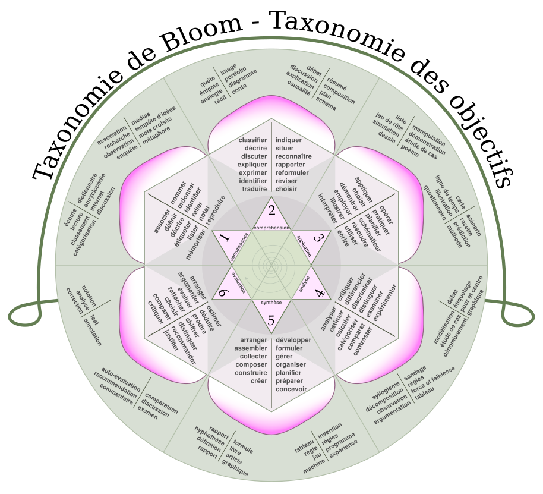

# TAXONOMIE DE BLOOM

La taxonomie de Bloom est un modèle pédagogique proposant une classification des niveaux d'acquisition des connaissances. Nommée d'après Benjamin Bloom (psychologue américain), elle est pourtant le résultat du travail d'un groupe de plus de 30 personnes (entre 1949 et 1953).

C'est un excellent outil pour rédiger les objectifs pédagogiques d'un cours ou d'une formation.

   
(*Blooms rose fr*, CC BY-SA PatrickHetu, [https://commons.wikimedia.org/wiki/File:Blooms_rose_fr.svg](https://commons.wikimedia.org/wiki/File:Blooms_rose_fr.svg))

### 1. Connaissance

Les objectifs pédagogiques peuvent être libellés à l'aide de verbes comme...   
**arranger, définir, dupliquer, étiqueter, lister, mémoriser, nommer, ordonner, identifier, relier, rappeler, répéter, reproduire...**

### 2. Compréhension

Les objectifs pédagogiques peuvent être libellés à l'aide de verbes comme...   
**classifier, décrire, discuter, expliquer, exprimer, identifier, indiquer, situer, reconnaître, rapporter, reformuler, réviser, choisir, traduire...**

### 3. Application

Les objectifs pédagogiques peuvent être libellés à l'aide de verbes comme...   
**appliquer, choisir, démontrer, employer, illustrer, interpréter, opérer, pratiquer, planifier, schématiser, résoudre, utiliser, écrire...**

### 4. Analyse

Les objectifs pédagogiques peuvent être libellés à l'aide de verbes comme...   
**analyser, estimer, calculer, catégoriser, comparer, contraster, critiquer, différencier, discriminer, distinguer, examiner, expérimenter, questionner, tester, cerner...**

### 5. Synthèse

Les objectifs pédagogiques peuvent être libellés à l'aide de verbes comme...   
**arranger, assembler, collecter, composer, construire, créer, concevoir, développer, formuler, gérer, organiser, planifier, préparer, proposer, installer, écrire...**

### 6. Évaluation

Les objectifs pédagogiques peuvent être libellés à l'aide de verbes comme...   
**arranger, argumenter, évaluer, rattacher, choisir, comparer, justifier, estimer, juger, prédire, chiffrer, élaguer, sélectionner, supporter...**

***notes personnelles***

---